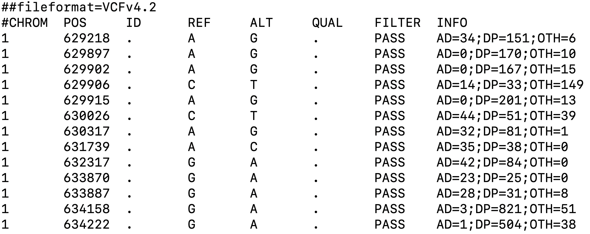
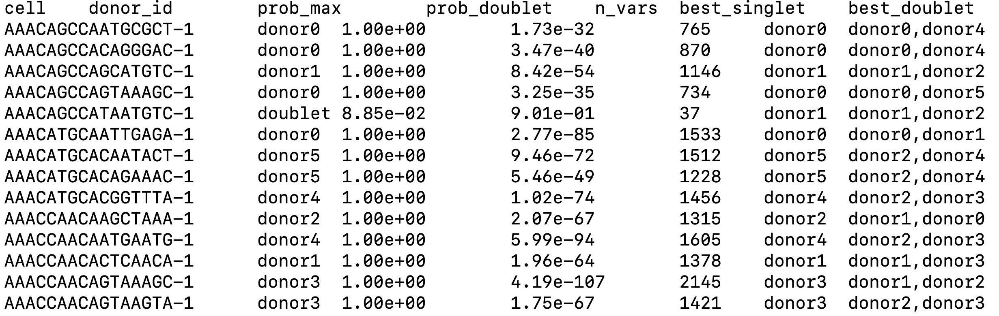
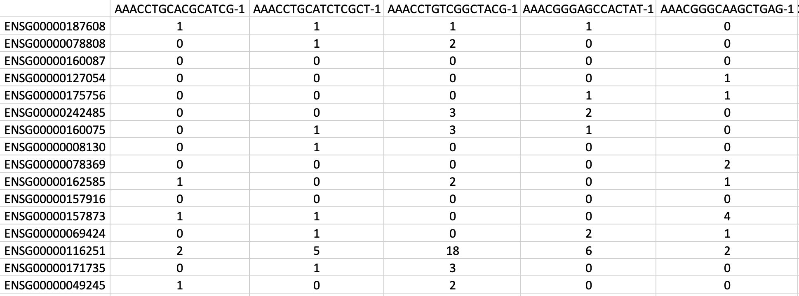
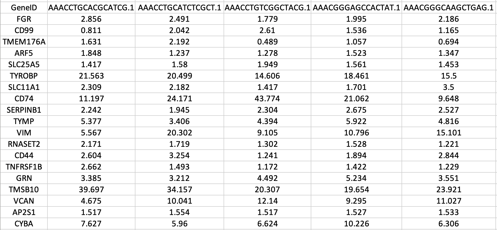
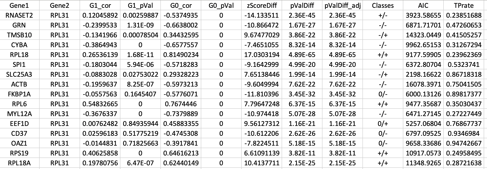
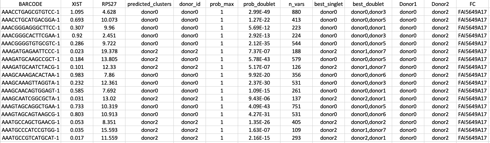
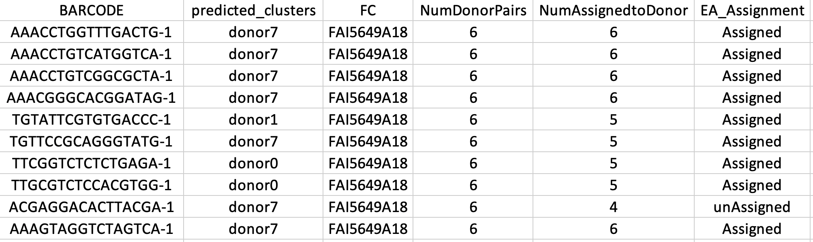

---
title: "scDIV: Single Cell RNA Sequencing Data Demultiplexing using Interindividual Variations"
author: "Isar Nassiri"
date: "January 23, 2023"
output: rmarkdown::html_vignette
vignette: >
  %\VignetteIndexEntry{scDIV: Single Cell RNA Sequencing Data Demultiplexing using Interindividual Variations\}
  %\VignetteEngine{knitr::rmarkdown}
  \usepackage[utf8]{inputenc}
---

* [Introduction](#introduction)
* [Easy Installation](#installation)
* [Step 1: Infer genetic variants from scRNA-seq data ](#Step1)
* [Step 2: Demultiplex pooled samples using genetic variants ](#Step2)
* [Step 3: Generate gene-cell count matrix ](#Step3)
* [Step 4: Gene Expression Recovery ](#Step4)
* [Step 5: Inter-individual Differential gene Correlation Analysis (IDCA) ](#Step5)
* [Step 6: Visualization of IDCA outputs ](#Step6)
* [Step 7: Expression Aware Demultiplexing per Donor Pair ](#Step7)
* [Step 8: Expression Aware Demultiplexing per sample pool ](#Step8)
* [Citation](#Citation)
* [Quick Resources](#QuickResources)

<a name="introduction"/>

### Introduction 
This documentation gives an introduction and user manual of scDIV (acronym of the Single Cell RNA sequencing data Demultiplexing using Interindividual Variations) an R package to use inter-individual differential co-expression patterns for demultiplexing the pooled samples without any extra experimental steps. 
<br />

<a name="installation"/>

### Easy Installation
1. Install the R [(LINK)](https://cran.r-project.org/)
2. Install the free version of rStudio [(LINK)](https://www.rstudio.com/products/rstudio/download/) [optional step]
3. Run the following command in R/rStudio to install scDIV as an R package:

```{r,eval=FALSE}
if (!requireNamespace("devtools", quietly = TRUE)) install.packages("devtools")
    
library(devtools)
install_github("isarnassiri/scDIV")
```

All dependency packages automatically will be downloaded, installed and loaded from CRAN-like repositories. We only tested scDIV in the R version 4.1.3 (2022-03-10) environment. You need to have root permission for this distribution, including the installation of any package.

You can find sample input files in `system.file("extdata", package = "scDIV")` folder.

<a name="Step1"/>

### Step 1: Infer genetic variants from scRNA-seq data 
cellsnp-lite is used to pileup the expressed alleles in single-cell data, which can be directly used for donor deconvolution in multiplexed single-cell RNA-seq data, which assigns cells to donors without genotyping reference [(LINK)](https://github.com/single-cell-genetics/cellsnp-lite). 

cellsnp-lite gets bam file and list of barcodes as variable inputs, a Variant Call Format (vcf) file listing all candidate SNPs (regionsVCF) as backend input variable:

```{r,eval=FALSE}
cellsnp-lite -s possorted_genome_bam.bam -b barcodes.tsv.gz -O FOLDER-NAME -R regionsVCF -p 22 --minMAF 0.05 --minCOUNT 10 --gzip 
```

cellsnp-lite generates a vcf file including called genetic variants as follows (Figure 1):

| {width=50%} | 
|:--:| 
| *Figure 1. Example of vcf file generated by cellsnp-lite.* |

<a name="Step2"/>

### Step 2: Demultiplex pooled samples using genetic variants
We use Vireo (Variational Inference for Reconstructing Ensemble Origin) for donor deconvolution using expressed SNPs in multiplexed scRNA-seq data [(LINK)](https://vireosnp.readthedocs.io/en/latest/).

Vireo gets variants info file provided by cellsnp-lite as an input: 

```{r,eval=FALSE}
vireo -c input-vcf-file -o output-folder --randSeed 2 -N Number-of-donors -t GP  
```

We use "donor_ids.tsv" file from outputs of Vireo for downstream analysis (Figure 2).

| {width=50%} | 
|:--:| 
| *Figure 2. Example of output from Vireo.* |

<a name="Step3"/>

### Step 3: Generate gene-cell count matrix
Raw count data from 10X CellRanger (outs/read_count.csv) or other single-cell experiments has the gene as a row (the gene name should be the human or mouse Ensembl gene ID) and the cell as a column. You can convert an HDF5 Feature-Barcode Matrix [(LINK)](https://support.10xgenomics.com/single-cell-gene-expression/software/pipelines/latest/advanced/h5_matrices) to a gene-cell count matrix using the cellranger mat2csv [(LINK)](https://support.10xgenomics.com/single-cell-gene-expression/software/pipelines/latest/output/matrices#mat2csv) command provided by 10Xgenomics. The cells in the `read_count.csv` file are from the filtered feature-barcode matrix generated by the cell ranger.

A filtered feature-barcode matrix generated by the cell ranger can be converted from HDF5 feature-barcode matrix to a gene-cell count matrix (read_count.csv) using the cellranger mat2csv (command provided by 10Xgenomics) as follows:

```{r,eval=FALSE}
cellranger mat2csv filtered_feature_bc_matrix.h5 read_count.csv
```

You can see an example of gene-cell count matrix in figure 3:

| {width=50%} | 
|:--:| 
| *Figure 3. Example of gene-cell count matrix file generated by mat2csv. Each column represent a borcode (cell). * |

<a name="Step4"/>

### Step 4: Gene Expression Recovery
In this step, we start to use a function from scDIV package. We use `GeneExpressionRecovery()` function for Gene Expression Recovery as follows. The `GeneExpressionRecovery()` function uses SAVER (single-cell analysis via expression recovery), an expression recovery method for unique molecule index (UMI)-based scRNA-seq data to provide accurate expression estimates for all genes in a scRNA-seq profile.

```{r,eval=FALSE}
library("scDIV")
csQCEAdir <- system.file("extdata", package = "scDIV")
Donors='donor6_donor2'
FC='FAI5649A17'
GeneExpressionRecovery( InputDir = csQCEAdir, Donors = Donors, FC = FC )
```

You can find the results in the SAVER/ folder with 'AssignedCells.txt' and 'AllCells.txt' extensions. You can see an example of transformed gene-cell count matrix in figure 4:

| {width=50%} | 
|:--:| 
| *Figure 4. Example of gene-cell count matrix file generated by SAVER.* |

<a name="Step6"/>

### Step 5: Inter-individual Differential gene Correlation Analysis (IDCA)
The `IDCA()` function uses correlation coefficients and performed Inter-individual Differential gene Correlation Analysis (IDCA) for two donors (D1 and D2) and genes (G1 and G2).

```{r,eval=FALSE}
library("scDIV")
ERP = "donor6_donor2_FAI5649A17_AssignedCells.txt"
Donors='donor6_donor2'
FC='FAI5649A17'
InputDir = system.file("extdata", package = "scDIV")
IDCA( InputDir, Donors, FC, ERP, TEST = T )
```

You can find the results in the IDCA_Analysis/ folder with "IDCA.txt" extention. You can see an example of `IDCA()` output in figure 5:

| {width=50%} | 
|:--:| 
| *Figure 5. Top differentially correlated pairs as well as their differential correlation statistics and correlation category (e.g., +/+). AIC and TPrate stands for "Akaike information criterion" and "true positive rate" which are indicators of gaussian mixture model clustering performance to replicate the cluster of cells per donor assigned by genetics demultiplexing.* |

<a name="Step7"/>

### Step 6: Visualization of IDCA outputs
The `IDCAvis()` function visualizes the outputs of IDC analysis.

```{r,eval=FALSE}
library("scDIV")
InputDir = system.file("extdata", package = "scDIV")
IDCAvis( InputDir )
```

You can find the results in the IDCA_Analysis/IDCA_Plots/ as pdf file(s) (Figure 6).

| {width=50%} | 
|:--:| 
| *Figure 6. Example of output from `IDCAvis()` function.* |

<a name="Step8"/>

### Step 7: Expression Aware Demultiplexing per Donor Pair
The `EADDonorPair()` function uses inter-individual differential co-expression patterns for demultiplexing per donor pair.

```{r,eval=FALSE}
library("scDIV")
InputDir = system.file("extdata", package = "scDIV")
EADDonorPair( InputDir )
```

You can find the results in the IDCA_Analysis/Expression_Aware_Cell_Assignment/ folder called "Expression_Aware_Cell_Assignment.txt" (Figure 7).

| {width=50%} | 
|:--:| 
| *Figure 7. Example of output from `EADDonorPair()` function. For an indicated pair of the donors (columns Donor1 and Donor2), `EADDonorPair()` uses a top differentially correlated gene pair (e.g., XIST and RPS27) and gaussian mixture model clustering to assign each cell (BARCODE column) to a donor (predicted_clusters column). In addition, we append the results of genetic demultiplexing (donor_id, prob_max, prob_doublet, n_vars, best_singlet, best_doublet) and flow cell ID (FC).* |

<a name="Step9"/>

### Step 8: Expression Aware Demultiplexing per sample pool
The `EADPoolSmaple()` function uses inter-individual differential co-expression patterns for demultiplexing the pooled samples:

```{r,eval=FALSE}
library("scDIV")
InputDir = system.file("extdata", package = "scDIV")
EADPoolSmaple( InputDir )
```

You can find the results in the IDCA_Analysis/Expression_Aware_Cell_Assignment/ folder called "Results_Expression_Aware_Cell_Assignment.txt" and "Summary.txt".

For instance as you can see in figure 8, for an indicated cell (BARCODE column) (e.g., AAACCTGGTTTGACTG-1), we consider all possibilities, and most of the time the cell is assigned to the donor 7 (predicted_clusters column). We confirm that the cell belongs to donor-7 (EA_Assignment column) if we successfully assign it to donor-7 (NumAssignedtoDonor column) for an equal or greater number of all pairs of donors (NumDonorPairs column) minus 1.

| {width=50%} | 
|:--:| 
| *Figure 8. Example of output from `EADPoolSmaple()` function. Please see text for more details.* |

<a name="Citation"/>

### Citation
Isar Nassiri, Benjamin Fairfax, Andrew J Kwok, Aneesha Bhandari, Katherine Bull, Angela Lee, Yanxia Wu, Julian Knight, David Buck, Paolo Piazza. Demultiplexing of Single Cell RNA Sequencing Data using Interindividual Variation in Gene Expression. 

<a name="QuickResources"/>

### Quick Resources
Latest version on GitHub [(LINK)](https://isarnassiri.github.io/scDIV/)

sessionInfo()
